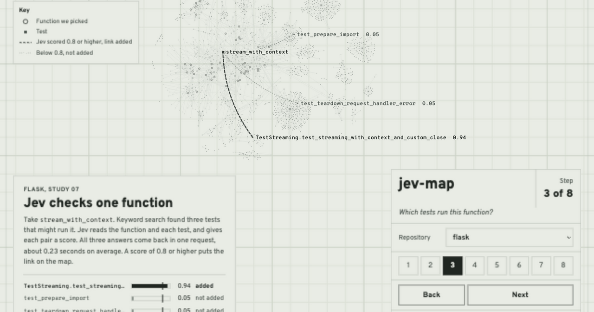
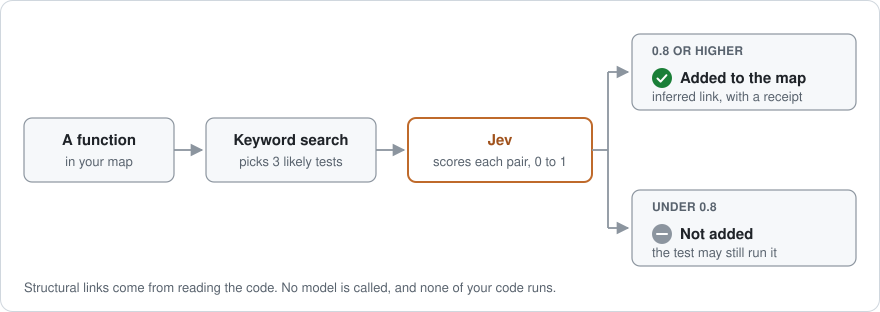

<h1 align="center">jev-map</h1>

<p align="center">
  <strong>Map each function to the tests that run it. Label every link with where it came from.</strong>
</p>

<p align="center">
  A test map for Python repositories, built for coding agents. jev-map reads your code and links each function to the tests that call it. If you turn it on, Jev, TypeSafe's system 1 model, can add the links that reading the code misses. Every link says whether it came from the code or from Jev, so an agent knows how much to trust it.
</p>

<p align="center">
  <a href="https://jev-map.vercel.app"><strong>Live demo</strong></a> ·
  <a href="#results"><strong>Results</strong></a> ·
  <a href="benchmarks/"><strong>Benchmarks</strong></a> ·
  <a href="docs/ROADMAP.md"><strong>Roadmap</strong></a>
</p>

<p align="center">
  <a href="https://github.com/krishhgg/jev-map/actions/workflows/ci.yml"></a>
  
  
  
  
</p>

<p align="center">
  <a href="https://jev-map.vercel.app"></a>
</p>

## Install

```bash
pip install "jev-map @ git+https://github.com/krishhgg/jev-map"
```

It needs Python 3.11 or later, and the core has no dependencies. For the MCP server, install the `mcp` extra instead:

```bash
pip install "jev-map[mcp] @ git+https://github.com/krishhgg/jev-map"
```

## Quick start

```bash
jev-map --repo /path/to/repo refresh                  # build the map without running any of your code
jev-map --repo /path/to/repo related-tests 'src/pkg/core.py::normalize'
jev-map --repo /path/to/repo explain-link 'src/pkg/core.py::normalize' 'tests/test_core.py::test_space'
```

Functions and tests are named `path::qualified_name`, and `jev-map symbols` lists them all. Every command prints JSON. `refresh` writes the map to `.jev-map/map.json`. Add `.jev-map/` to your `.gitignore`, because the map holds excerpts of your source.

## How it works

<p align="center">
  
</p>

A map has two kinds of links.

- **Structural links come from reading the code.** jev-map follows the calls it can resolve without running anything, including import aliases and calls through other functions. A structural link is a possible call path, not proof that the test runs the function.
- **Inferred links come from Jev, and only when you ask for them.** For each function, **keyword search** picks up to three likely tests that don't have a structural link yet. It ranks tests by the words they share with the function, and rare words count more. Jev scores each pair from 0 to 1, and pairs at 0.8 or higher go on the map as `inferred`. jev-map uses the score only as a cutoff, not as a probability.
- **Every Jev call keeps a receipt.** The exact request and response are saved under `.jev-map/receipts/`. You can see what Jev was shown, and replay the map later without an API key.
- **A missing link never means a test is safe to skip.** Jev says no to many links that tests do run. Use the map to choose which tests to run first, and keep running the rest.

## Results

The repo has seven benchmark studies, and the four below ask the main questions. Each one froze its sample before any results came in. Each checked Jev's answers by running the tests under a **tracer**, a tool that records every function a test calls.

| Study | Repositories | Question | Result |
| --- | --- | --- | --- |
| [03](benchmarks/03-multi-repo-relationships/FINDINGS.md) | Boltons, h11, Pluggy | When Jev says yes, is it right? | 34 of its 39 yeses were confirmed. It said no to 64 links that the tests did run. |
| [05](benchmarks/05-heldout-toolbelt/FINDINGS.md) | h11, Pluggy, Boltons, with 144 new functions | Is Jev better than keyword search, and does the first suggested test improve? | Jev was right on 102 of 117 links, and keyword search making the same number of picks was right on 77. The first suggested test ran the function for 105 of 134 functions, up from 97. Both pass marks set before the study were met. |
| [06](benchmarks/06-agent-navigation/FINDINGS.md) | cachetools, Tenacity, attrs | Does a coding agent find the right test more often with Jev's hints? | No. It got 23 of 24 with or without them. A small LLM's hints got 24, and they cost about 10 times as much to make. |
| [07](benchmarks/07-popular-repos/FINDINGS.md) | Flask, FastAPI, langchain-core, yt-dlp, Graphify | Does study 05 hold up on popular repos? | Jev was right on 39 of 48 links, and keyword search on 13 of 48. The first suggestion improved from 97 to 100 of 191. Neither pass mark was met. The first-test gain was too small, and 7 of 240 Jev requests failed on oversized inputs, which the rules didn't allow. |

Jev is good at one narrow job, which is picking the real links out of a few candidates. 81 to 87% of its yeses were right, against 27 to 66% for keyword search making the same number of picks. The Jev requests for study 07's 240 functions cost about 6 cents at TypeSafe's published price. It also says no to many real links, and in the agent study a capable agent found the right tests without its help. So jev-map keeps Jev optional and treats its links as hints.

<details>
<summary><strong>The three smaller studies</strong></summary>

- [01, mapping smoke test](benchmarks/01-mapping-smoke/README.md). Five tests on a tiny example repo, with real calls recorded. In two live runs, Jev added the one link the code map missed and rejected the other 11 candidates both times. This checks the wiring, not accuracy.
- [02, indexing pilot](benchmarks/02-repository-index/README.md). Checks that the mapper can parse a real public repository, Boltons, and return structural links. It doesn't measure accuracy, Jev, or agents.
- [04, Graphify and keyword baselines](benchmarks/04-product-baselines/README.md). An exploratory look back at study 03's sample. At the same number of links, Jev found 34 confirmed links and a keyword ranker found 32, so it showed no clear edge over the cheap baseline.

</details>

## Use it from a coding agent

jev-map includes an **MCP** server. MCP, the Model Context Protocol, is the standard way coding agents call outside tools.

```bash
jev-map --repo /absolute/path/to/repo serve
```

Add it to your agent's MCP config:

```json
{
  "mcpServers": {
    "jev-map": {
      "command": "jev-map",
      "args": ["--repo", "/absolute/path/to/repo", "serve"]
    }
  }
}
```

The agent gets four tools: `related_tests(symbol)`, `explain_link(function, test)`, `refresh_map()` and `enrich_symbol(symbol)`. The server stays bound to that one repository, and its tools can't open another path or ask for an API key. To let it call Jev, start it with `serve --jev --max-calls 20`. The call limit covers every refresh and enrichment in that session.

## Turn on Jev

Jev is off by default, and a plain `refresh` never leaves your machine. Turning Jev on sends selected source excerpts and imports to TypeSafe.

```bash
export TYPESAFE_API_KEY=...                                                  # or pass --env-file /path/to/private/.env
jev-map --repo /path/to/repo refresh --jev --max-calls 20                    # ask about the whole map
jev-map --repo /path/to/repo enrich-symbol 'src/pkg/core.py::normalize'      # or one function at a time
```

If you use [tokenstash](https://github.com/krishhgg/tokenstash), `tokenstash need TYPESAFE_API_KEY` writes the key to `.env.local` without you pasting it anywhere. Then pass `--env-file .env.local`.

## More

<details>
<summary><strong>Command overview</strong></summary>

| Command | What it does |
| --- | --- |
| `jev-map refresh` | Rebuild the map. Add `--jev` to ask Jev about new candidate pairs, up to `--max-calls` requests (default 20). |
| `jev-map symbols` | List every function and test as `path::qualified_name`. |
| `jev-map related-tests SYMBOL` | The tests linked to a function, with each link's evidence. |
| `jev-map explain-link FUNCTION TEST` | Why one function and one test are linked. |
| `jev-map enrich-symbol SYMBOL` | Ask Jev about one function on a fresh map. It makes one request by default. |
| `jev-map serve` | Run the MCP server for one repository. |

`--threshold` (default `0.8`) sets the cutoff, `--candidates` (default `3`) sets how many tests keyword search picks per function, and `--model` picks the Jev model (default `jev-1.13.0`). `--max-calls 0` replays saved Jev answers without a key. Every command takes `--repo`, which defaults to the current folder.

</details>

<details>
<summary><strong>What the map can't see</strong></summary>

jev-map never imports or runs your code, so it only sees calls it can resolve from the source. It doesn't fully follow dynamic dispatch, re-exports, nested functions, pytest fixtures or custom source roots. Files Git ignores and symlinks are left out. Without Git, hidden folders and common generated folders are left out. A Python file that is too large or doesn't parse shows up as a diagnostic instead of stopping the build. If any included Python file is added, changed or deleted, queries refuse the old map until you run `refresh` again.

</details>

<details>
<summary><strong>How Jev requests are made</strong></summary>

Requests go to one fixed HTTPS endpoint, with a 30-second timeout, no redirects and no automatic retry. A failed request keeps the structural links, records a sanitized error, and makes the command exit with code 1. The saved receipt is matched on the model, the questions, every candidate and the source context. So running `refresh` again reuses identical requests, and only asks again when something changed. Request budgets and oversized excerpts show up as skipped counts, and missing token usage is reported as unknown, never as zero.

</details>

<details>
<summary><strong>The demo</strong></summary>

[jev-map.vercel.app](https://jev-map.vercel.app) replays studies 05 and 07 on Graphify's own code graph for eight repositories. `demo/build.py` builds it from the archived results, and nothing is re-run. See [demo/README.md](demo/README.md).

</details>

## Development

```bash
git clone https://github.com/krishhgg/jev-map && cd jev-map
python -m pip install -e '.[mcp,benchmark]'
python -m unittest discover -s tests -v
```

CI runs the tests and a command-line smoke check on Python 3.11 to 3.13. The tests need no Jev key and no network. Guidelines for contributors and coding agents are in [AGENTS.md](AGENTS.md).

## License

MIT. Jev is a separate service from [TypeSafe](https://typesafe.ai), and it needs its own API key.
